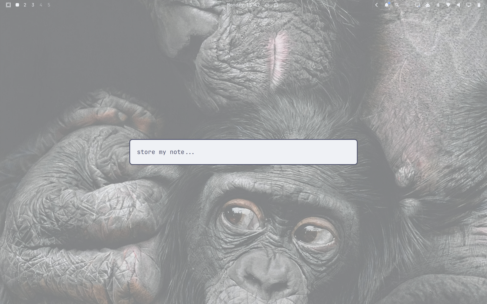

# Omajot

One key, one line, appended to `~/omajot.md`. A capture overlay for
[Omarchy](https://omarchy.org/).



## Install

```bash
omarchy plugin add https://github.com/phausser/omajot.git
```

Omajot runs **unsandboxed** inside `omarchy-shell`. Review the code in
`~/.config/omarchy/plugins/io.github.phausser.omajot/`, then run setup once:

```bash
bash ~/.config/omarchy/plugins/io.github.phausser.omajot/scripts/setup.sh
```

## Shortcuts

**Super + N** toggles capture; **Super + Alt + N** opens the configured file
in your default editor.

Setup backs up `~/.config/hypr/bindings.lua`, adds missing shortcuts, reloads
Hyprland, and enables Omajot. Existing Omajot shortcuts are kept; conflicts
stop setup. Use `--check` to check without making changes.

## Usage

- **Enter** saves and closes; empty input closes without saving.
- **Escape** or **Super + N** discards and closes.
- **Ctrl+U** clears the input.
- **Up** recalls the last saved text. Saving appends a new line.

Closing restores the previous window's focus. Input is limited to 4000 characters.
Write errors keep the overlay open and preserve your draft.

Notes are UTF-8 plaintext, appended with local timestamps:

```text
2026-09-10 15:01  Review the pull request tomorrow
```

## Configuration

The default file is `~/omajot.md`. To change it, create `~/.config/omajot.json`:

```json
{"path": "~/inbox.md"}
```

Use an absolute path or `~/…`. The parent directory must exist; Omajot creates
only the file. Configuration changes reload automatically.

## Remove

```bash
omarchy plugin remove io.github.phausser.omajot
```

Your note file is preserved. Remove the Omajot bindings from
`~/.config/hypr/bindings.lua` if you no longer need them.

## License

[MIT](LICENSE). Product contract: [SPEC.md](SPEC.md).
